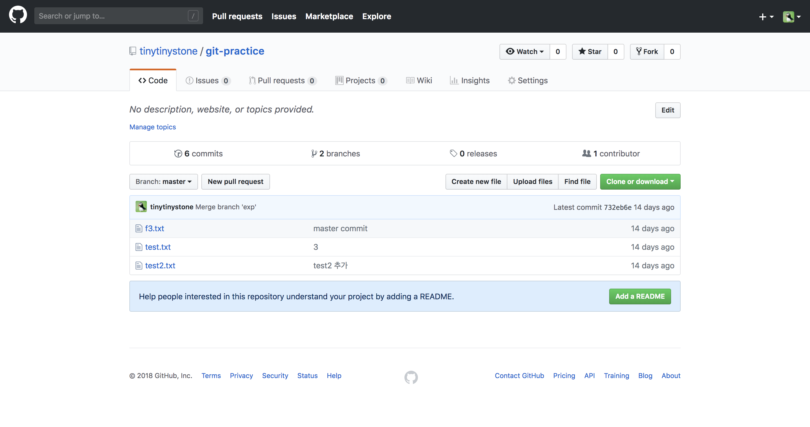

# 9/19, 20(수, 목) 과제 (자율 참여)

Github 사이트 중 일부를 그대로 만들어보는 과제입니다.

지난주와 달리 개별적으로 수행하시면 되며, 목요일에 조별 토론하는 시간을 가지겠습니다.

본 폴더를 로컬 컴퓨터에 git clone 받은 후, skeleton.html 파일과 style.css 파일에 작업을 해주시면 됩니다.

[Github 페이지 링크](https://github.com/tinytinystone/git-practice)

- 주의사항
  * 최대한 코드를 보지 않고 작성해주세요.
  * 아이콘 등은 [Octicons 파일](https://octicons.github.com/)을 참고하여 작성하시면 됩니다.
- 기한: 9/20(목) 낮 1시까지
- 조별 토론: 9/20(목) 14-15시